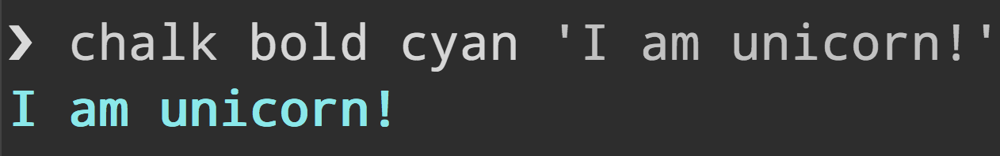

# chalk-cli [](https://www.npmjs.com/package/chalk-cli) [](https://repl.it/github/chalk/chalk-cli)

> Terminal string styling done right



## Install

```sh
npm install --global chalk-cli
```

## Usage

```
$ chalk --help

  Usage
    $ chalk <style> ... <string>
    $ echo <string> | chalk <style> ...

  Options
    --template, -t    Style template. The `~` character negates the style.
    --stdin           Read input from stdin rather than from arguments.
    --no-newline, -n  Don't emit a newline (`\n`) after the input.
    --demo            Demo of all Chalk styles.

  Examples
    $ chalk red bold 'Unicorns & Rainbows'
    $ chalk -t '{red.bold Unicorns & Rainbows}'
    $ chalk -t '{red.bold Dungeons and Dragons {~bold.blue (with added fairies)}}'
    $ echo 'Unicorns from stdin' | chalk --stdin red bold
```

See [supported styles](https://github.com/chalk/chalk#styles).

## Template syntax

- `{red.bold unicorn}`
- `{red.bold unicorns} are {blue FUN!!!}`
- `{red.bold unicorn {blue.underline dancing}}`
- `{red red {~red normal}}`
- `{red hey\} still red} not red`
- `{red hey\\} not red`

## Related

- [chalk](https://github.com/chalk/chalk) - API for this module

## Maintainers

- [Sindre Sorhus](https://github.com/sindresorhus)
- [Josh Junon](https://github.com/qix-)
